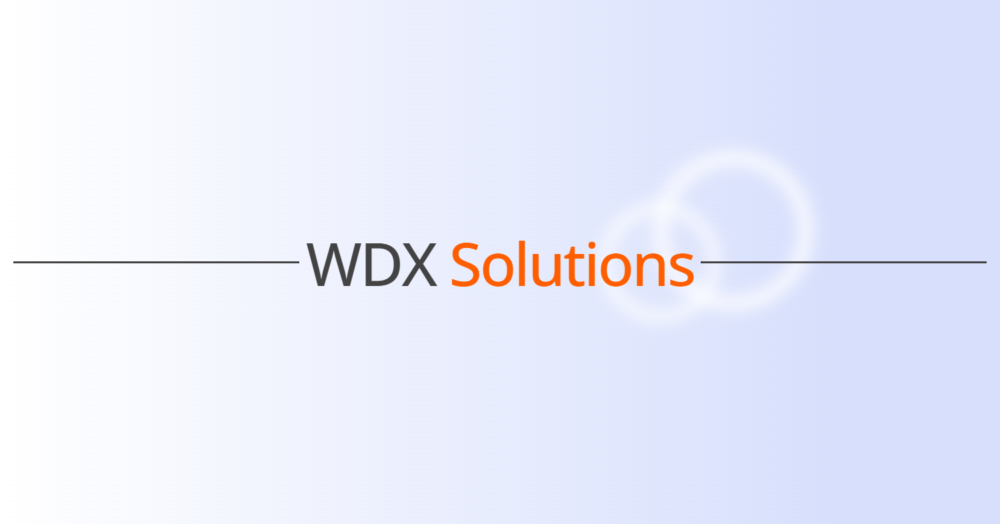

# Portfolio Website

Dive into my personal portfolio, meticulously engineered to demonstrate my prowess in web development and UX/UI design.



## Description

Welcome to the repository containing the source code for my portfolio website, meticulously crafted to showcase my expertise in web development. This platform serves as a testament to my proficiency in leveraging cutting-edge technologies to deliver immersive digital experiences and elevate online presence.

## Technologies Used

-   HTML5
-   CSS3
-   Vanilla JavaScript
-   Netlify (for deployment)

## Features

-   **Optimized Performance**: Experience lightning-fast load times and seamless navigation thanks to optimized code and efficient resource management.
-   **Cutting-Edge Design**: Explore visually stunning designs and intricate animations, showcasing my ability to blend creativity with technical precision.
-   **Responsiveness**: Enjoy an optimal viewing experience across various devices and screen sizes, ensuring seamless accessibility and usability.
-   **SEO Enhancement**: Harness the power of strategic optimization techniques, including social share previews and metadata enhancements, to maximize online visibility and search engine ranking.
-   **Dynamic Theme Switching**: Personalize the browsing experience with the ability to switch between light and dark themes seamlessly.
-   **Downloadable CV**: Gain access to my professional resume directly from the website, providing comprehensive insights into my skills and experience.
-   **Contact Form**: A contact form is available for users to reach out, featuring input validation and error handling, ensuring a smooth communication process.

## Installation

1. Clone the repository:

```
git clone https://github.com/Sasho32/WDX-Solutions.git
```

2. Open the project folder.

3. Launch the `index.html` file in a web browser to explore the website locally.

## Usage

Navigate through the website sections using the provided links in the navigation menu. Explore my expertise, projects, and contact information. Download my CV if interested and reach out via the contact form.

## License

This project is licensed under the [MIT License](./LICENSE).
